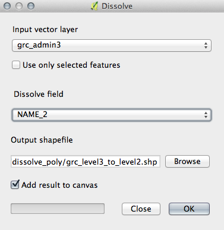

> [GIS fundamentals | Training Course](agenda.md) ▸ **Dissolving polygons**

## Targeted skills
By the end of this module, you will know how to:
* dissolve/merge polygon features by attribute (see explanation below)

## Data
Data to be used in this module can be found in the following folder:
```
data/grc_admin3
```
## Exercise outline & memos


###  Dissolving/merging polygon features by attribute

This operation looks a bit esoteric but the idea is simple. Let's take an example, imagine
a country where the main administrative levels are provinces further divided into regions.
You want a shapefile of these provinces but you only have for now a shapefile of the regions. 

If in your "regions" shapefile, the attribute table contains the province name for each region feature
(see table below), then you can dissolve/merge the polygons by attribute (in our case "province").

| province | region |
|----------|--------|
| prov_a   | reg_1  |
| prov_a   | reg_2  |
| prov_b   | reg_3  |
| prov_b   | reg_4  |
| ...      | ...    |

To do so go through the following steps:

```
Open: data/grc_admin3/grc_admin3.shp
```

```
[In QGIS top menu] 
Vector ▸ Geoprocessing Tools ▸ Dissolve...
```

then reproduce the settings below:



```
Save shapefile created as: "grc_level3_to_level2"
```

As simple as that !
