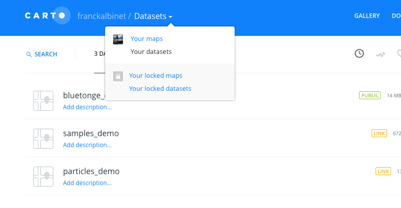

> [GIS fundamentals | Training Course](agenda.md) ▸ **Introduction & data upload**

## Targeted skills
By the end of this module, you will know:
* what is Carto 
* and how to upload your dataset

## Data
Data to be used in this module can be found in the following folder:

```
data/
```
## Exercise outline & memos


### 1. Introduction

[Carto](https://carto.com/) (renamed recently - was CartoDB before), is a Software As A Service [SaaS](https://en.wikipedia.org/wiki/Software_as_a_service). It means that once you have created an account, you gain full access to a set of technologies (database engine, map rendere, ...) in your web browser/navigator (Chrome, Firefox, ...) that you normally install in a dedicated server in your institution or in your own desktop. 

The advandage is that you don't need to install, maintain them, this is done by the Service provider. Obviously, you need to pay for this service. Hopefully, you can create a free account that will already allow you to create and disseminate your map/visualization through the web. 

To create a free account, follow this link [https://carto.com/signup](https://carto.com/signup)

To have an overview of the beautiful maps/visualization you can create, follow this link: [https://carto.com/gallery/](https://carto.com/gallery/)

To get access to a wide range of tutorials, follow this link: [https://carto.com/docs/tutorials/](https://carto.com/docs/tutorials/)

### 2. Upload your data
Our goal here it to create an animation of animal disease cases registered 

Once logged in, you will be directed to your Carto Dashboard. Carto web application is mainly composed of two components/pages: the "Datasets" and "Maps" (see screenshot below):



To upload a new dataset:

```
[In Carto Top Menu]
Select "Your datasets"

from there simply click on button "NEW DATASET" (top-right)

drag and drop "bluetongue_carto.csv" file you will find under data/ folder

and finally

click on "CONNECT DATASET" button (bottom-right)
```
Your dataset is uploaded! Carto allows you to consider your dataset from two prespective/representations (as in QGIS): a tabular and map representations.

