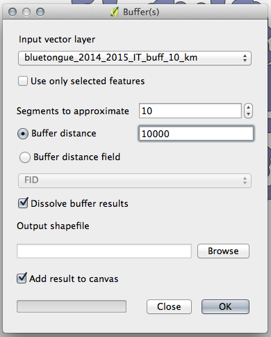

> [GIS fundamentals | Training Course](agenda.md) ▸ **Creating buffers (zoning)**

## Targeted skills
By the end of this module, you will know how to:
* create zone (buffers) around features of interest (points, lines, polygons)
* dissolve individual buffers into one single zone

## Data
Data to be used in this module can be found in the following folder:
```
data/bluetongue_2014_2015_IT
```
## Exercise outline & memos

A buffer in GIS is simply a zone around a map feature measured in units of distance or time. A buffer is useful for [proximity analysis](https://en.wikipedia.org/wiki/Proximity_analysis).

### Creating zones (buffers)

Open a subset of "bluetongue_2014_2015.shp" recently created including only cases in Italy: 

```
data/bluetongue_2014_2015_IT/bluetongue_2014_2015_IT.shp
```
Access Geoprocessing "Buffer" tool:

```
[In QGIS top menu] 
Vector ▸ Geoprocessing Tools ▸ Buffer(s)...
```

Once "Buffers" window/dialog opened, you will notice that a distance should be specified.
If you take a look at current CRS of the "bluetongue" layer (see for instance that coordinates
are in degrees in the status bar), you will notice that this layer is not projected and use WGS84
(World Geodetic System) as coordinate system and ellipsoid of reference. So distance should be specified in degrees. 

To be able to specify distances in meters for instance, we need to use a map projection.
```
Save "bluetongue_2014_2015_IT.shp" as "bluetongue_2014_2015_IT_merc.shp using "Mercator" 
projection for instance.
Reminder: click right on the layer ▸ Save As... ▸ and choose "Google Mercator" projection
```

```
Open create layer "bluetongue_2014_2015_IT_merc.shp" and check there is no projection on the fly 
Reminder: Project ▸ Project Properties ▸ CRS
```

You will notice now (in status bar) that coordinates are in meters.

Open Buffer(s) tool:

```
[In QGIS top menu] 
Vector ▸ Geoprocessing Tools ▸ Buffer(s)...
```

Specify the following:



The dissolve checkbox allows to create the union of individual buffers created.

Check with the ruler that the buffers cover regions of 10km radius and

```
Style the buffer layer and overlay it over Google Maps
```

