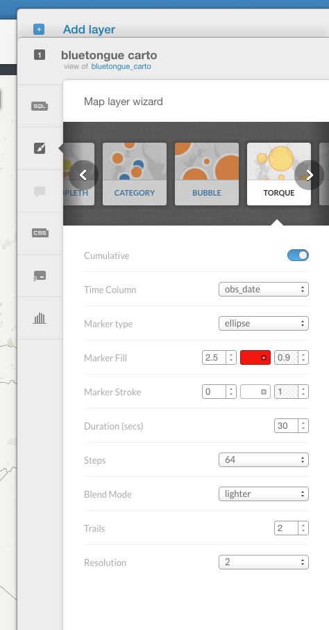
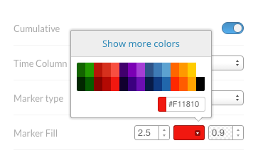
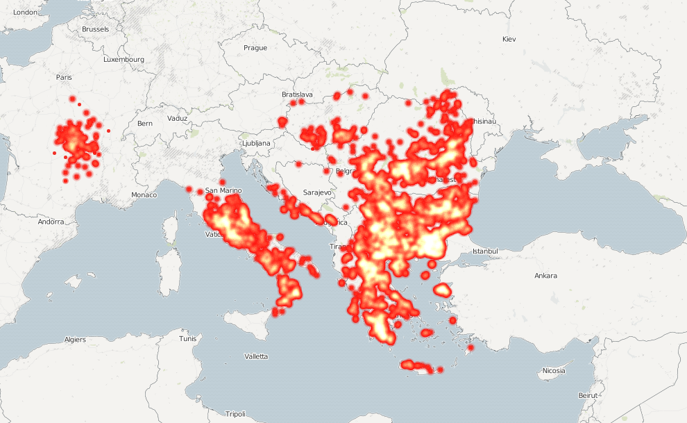

> [GIS fundamentals | Training Course](agenda.md) ▸ **Create & disseminate an animation of disease spread over time**

## Targeted skills
By the end of this module, you will know:
* create an animation of disease cases over time
* disseminate your visualization to the web

## Data

```
the dataset uploaded in previous module
```

## Exercise outline & memos


### 1. Creating an animation of disease cases over time

Our goal here it to create an animation of animal disease cases registered. 

To create a new map:

```
[From Carto Dashboard]
Select "Your maps"

from there simply click on button "NEW MAP" (top-right)

click on "bluetongue_carto" dataset and click on button "CREATE MAP" (bottom-righ)

rename your newly create map "bluetongue_disease_spread" by just clicking on top-left "Untitled Map" and writing the new one

then on right panel, click the brush icon (tooltip showing "wizard" when hovering on it)

and after having clicled to "Torque" wizard, reproduce settings shown below:
```



To get the proper color for "Marker Fill", click on the "colored box" and enter the following code: "#F11810"



Once done, you should get the following map:



or the animated version at the following link []()

<iframe width="100%" height="520" frameborder="0" src="https://franckalbinet.carto.com/viz/d1957f20-8a31-11e6-a66c-0e05a8b3e3d7/embed_map" allowfullscreen webkitallowfullscreen mozallowfullscreen oallowfullscreen msallowfullscreen></iframe>


You should get
