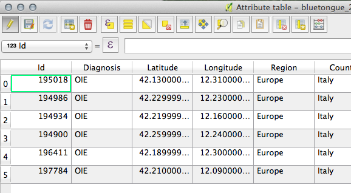

> [GIS fundamentals | Training Course](agenda.md) ▸ **Editing an existing layer**

## Targeted skills
By the end of this module, you will know how to:
* add, edit and delete a new feature in an existing file.

## Data
Data to be used in this module can be found in the following folder:
```
data/bluetongue_2014_2015_edit
```
## Exercise outline & memos


### 1. Add, edit and delete features via attribute table
```
Open: data/bluetongue_2014_2015_edit/bluetongue_2014_2015_edit.shp and overlay
it over Google Hybrid background layer.
```

To edit a layer, you need to toggle the "Editing mode", there several ways to do so.

First:
```
[In Layers Panel]
Select (click) the layer of interest, here blueongue_2014_2015_edit
```

then,

Option 1:

```
[In QGIS top menu] 
Layer ▸ Toggle Editing
Open the attribute table
```

Option 2:

```
[In QGIS top toolbar] 
Click on "Pencil" icon
Open the attribute table
```

Option 3:

```
[In Layers Panel] 
Right click on the layer of interest and click "Toggle Editing"
Open the attribute table
```

Option 4:
```
Simply directly open the attribute table and toggle editing via the
"Pencil" icon (top left toolbar)
```
Once attribute table opened and editing mode toggled, the top toolbar will give you all the required options: add, delete and edit features (see screenshot below).

Hints: Remember that hovering over an icon will open a tooltip showing button function.




### 2. Add, edit and delete features via map

Exercise:

```
[In QGIS top toolbar] 
find the "Add Feature" button
```

then by clicking on the map at a specific location, you will be asked to enter attribute values for this new feature.

Warning: in all cases, don't forget to save your layer once edited.


