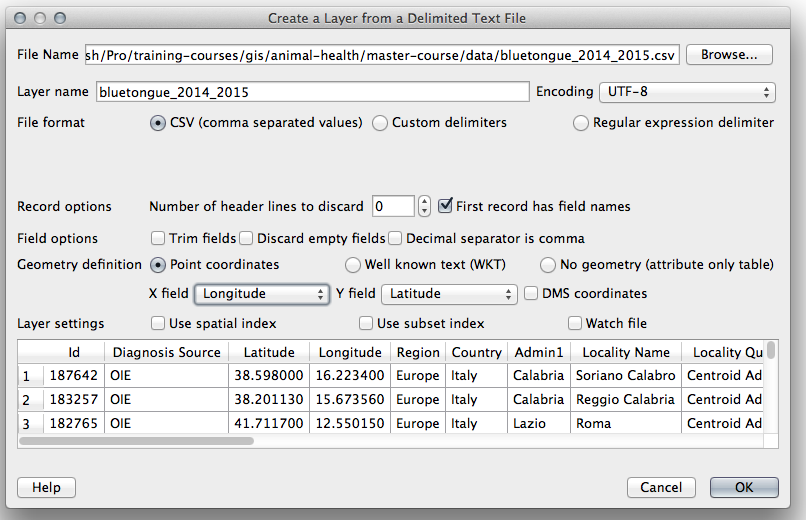

> [GIS fundamentals | Training Course](agenda.md) ▸ **Importing Excel files**

## Targeted skills
By the end of this module, you will know how to:
* convert Excel file to csv (comma separated value) files
* import/convert csv file with lat, lon attributes into GIS layer

## Data
Data to be used in this module can be found in the following folders:
```
data/bluetongue_2014_2015.xls
```
## Exercise outline & memos

### 1. Converting Excel file format to csv 

Before being able to import your data into QGIS as a plain GIS layer, you need to pre-process it via Microsoft Excel or OpenOffice for instance.
To do so for instance with Microsoft Excel:
```
Open: data/bluetongue_2014_2015.xls

[In Excel top menu] 
File ▸ Save As..
[In Save window/dialog]
Change "Format" dropdown to "Windows Comma Separated (.csv)
```

### 2. Importing/converting csv file with lat, lon attributes into GIS layer
```
[In QGIS top menu] 
Layer ▸ Add Layer ▸ Add Delimited Text Layer...
```
then reproduce settings shown below (File format, First record as field names, X field, ...:



```
Click "OK"
```

```
Select "WGS84" as CRS then click "Ok"
```

```
Finally, save the layer as shapefile: click right on layer and "Save As"
```

Congrats, you have created your first GIS layer / shapefile from scratch !


