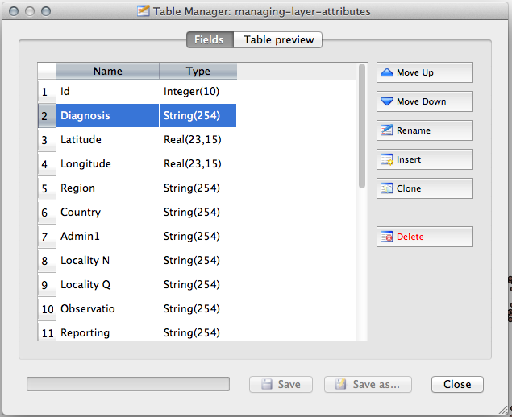

> [GIS fundamentals | Training Course](agenda.md) ▸ **Managing data attributes**

## Targeted skills
By the end of this module, you will know how to:
* rename attributes
* change attributes type (Integer, String, Real)
* add/delete attributes

## Data
Data to be used in this module can be found in the following folders:
```
data/managing-layer-attributes/
```
## Exercise outline & memos

### 1. Rename, change, add, delete table attributes

```
Install "Table Manager" plugin if not already installed. 
If/when installed the plugin needs to be activated (checkbox on).

Open: data/managing-layer-attributes/managing-layer-attributes.shp

[In QGIS top menu] 
Vector ▸ Table Manager ▸ Table manager
```

You will get the following window/panel:



```
Select a field/attribute and apply action of interest: move up, down, rename, clone
```

Warning: after modification you can either save (overwrite) the original layer or save it as another name.
