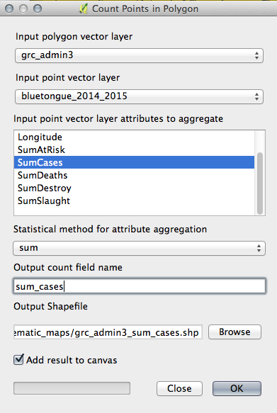
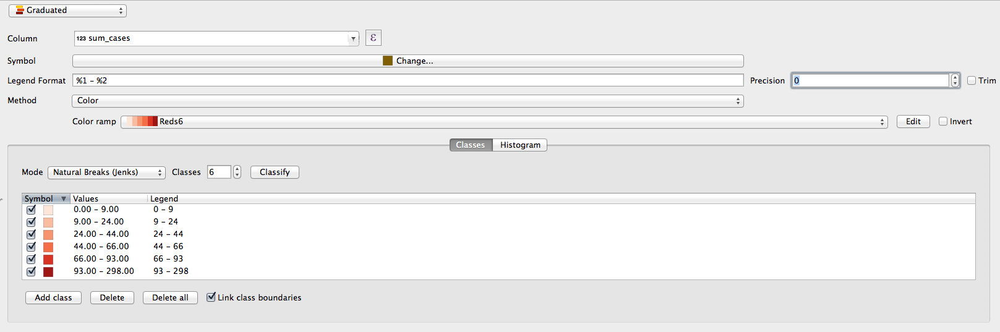

> [GIS fundamentals | Training Course](agenda.md) ▸ **Mapping number of cases by administrative boundaries**

## Targeted skills
By the end of this module, you will know how to:
* create a choropleth map
* visualize density instead of absolute values (which might be misleading)
* create a proportional circles map
* how to dissolve polygons

## Data
Data to be used in this module can be found in the following folder:
```
data/bluetongue_2014_2015
data/grc_adm3
```

## Exercise outline & memos

In this series of exercises we will create a thematic maps showing the spatial distribution of diseases cases by administrative 
boundaries (here Greece administrative boundaries level 3 decentralized administrations).


### 1. Creating a [choropleth](https://en.wikipedia.org/wiki/Choropleth_map) map

In a new project, open first "bluetongue_2014_2015.shp" recently created including only cases in Italy: 

```
data/bluetongue_2014_2015/bluetongue_2014_2015.shp
````

then open the administrative level 3 boundaries shapefile for Greece:

```
data/grc_admin3/grc_admin3.shp
````

Now we will sum the number of cases by admin. level 3 (following the same step as in previous module)

```
[In QGIS top menu] 
Vector ▸ Analysis Tools ▸ Points in Polygon...
Reproduce settings below and click "OK" (save new file as "grc_admin3_sum_cases.shp"
```



```
[In QGIS Layers Panel]
Hide both grc_admin3 and bluetongue_2014_2015, keeping only grc_admin3_sum_cases visible
```

Now to create the choropleth map:

```
[In QGIS Panel Layers] 
Click right on newly created "grid_nb_cases.shp" to open its property panel.
Reproduce the settings shown below (settings will be further commented during live session)
```



Warning: Now, one important issue with that kind of map is that bigger administrative regions area likely to include more points, so more cases. As a result, most often, that kind of maps just shows that the bigger is the region the more case we get (which is not so much informative).

Instead, we would prefer to map density, i.e normalize the number of cases by the area. This is what we will do next.
