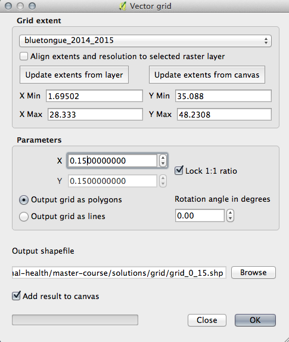
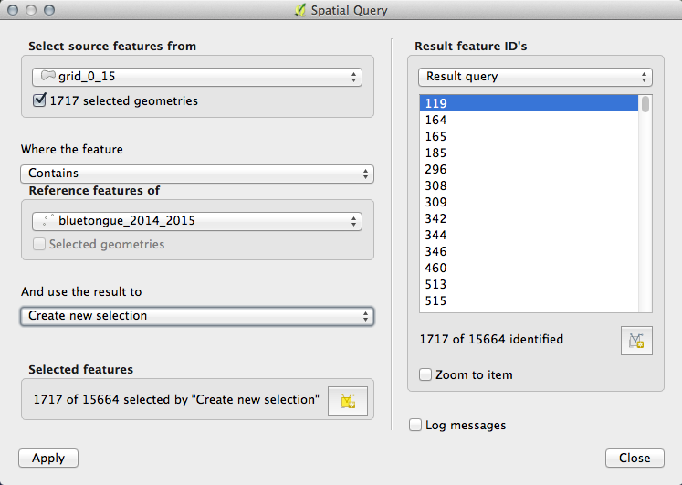
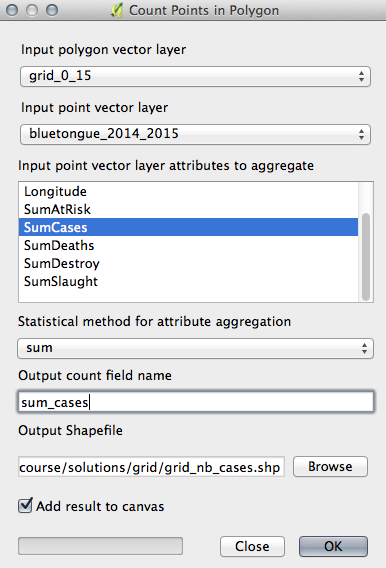
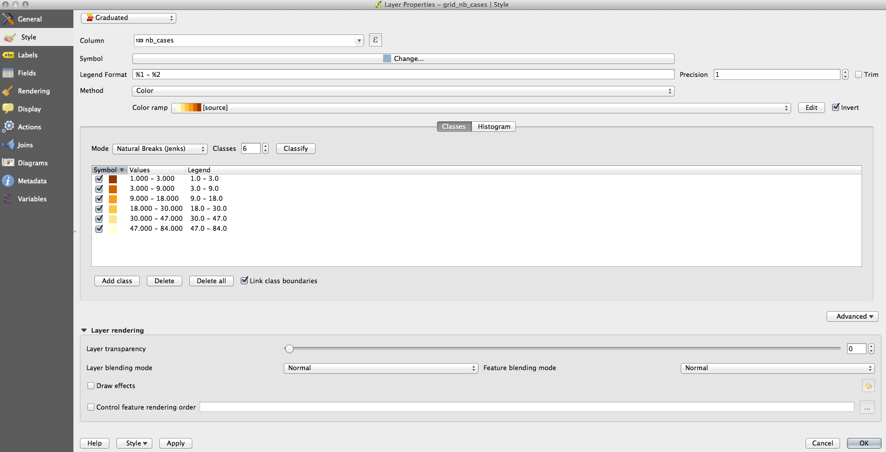

> [GIS fundamentals | Training Course](agenda.md) ▸ **Mapping number of cases in a grid**

## Targeted skills
By the end of this module, you will know how to:
* generate a grid based on a point layer extent and scale
* select grid cells including points (spatial query)
* aggregate (sum) number of animal disease cases by grid cell
* create a thematic map of number of cases

## Data
Data to be used in this module can be found in the following folder:
```
data/bluetongue_2014_2015/
```
## Exercise outline & memos

This module might look a bit challenging but will worth the effort given that you will be able at the
end to have a clear understanding of the spatial distribution of cases over the region of interest.

### 1. Generating a grid

Open:

```
data/bluetongue_2014_2015/bluetongue_2014_2015.shp
```

```
[In QGIS top menu] 
Vector ▸ Research Tools ▸ Vector Grid...
Reproduce setting shown below and save the new file as: grid_0_15.shp
``` 

and reproduce settings shown below and don't forget to press "Update extents from Layer" button in order to automatically set the grid extent to the point layer extent:



### 2. Selecting grid cells including points only

Based on the resolution chosen for your grid (X and Y parameters), you might end up with a very large grid whose cells will not include any points. Just remember, that our goal is to aggregate, sum the number of disease case per grid cell. Many of the cells generated will be "empty" and will be useless. We want here to get rid of them.

To do so, we will simply run a simple spatial query as seen previously:

```
Install "Spatial Query Plugin" if not already installed. If/when installed the plugin needs to be
activated (checkbox on).

Select a country, let's say "Brazil" 

[In QGIS top menu] 
Vector ▸ Spatial Query ▸ Spatial Query

[In "Select source features from" dropdown], choose: "grid_0_15"
[In "Where the features" dropdown], choose: "Contains"
[In "Reference features of"], choose: "bluetongue_2014_2015"

Then click "Apply"

[In Layers Panel] 
Click right on "grid_0_15" and save as... 
(be sure to check "Save only selected features") grid_0_15_selected.shp
```




### 3. Summing number of animal disease cases by grid cell

```
[In QGIS top menu] 
Vector ▸ Analysis Tools ▸ Points in Polygon...
Reproduce settings below and click "OK"
```



### 4. Create a thematic map of number of cases

```
[In QGIS Panel Layers] 
Click right on newly created "grid_nb_cases.shp" to open its property panel.
Reproduce the settings shown below (settings will be further commented during live session)
```



Then finally,

```
Overlay the thematic map over Google Maps.
```


