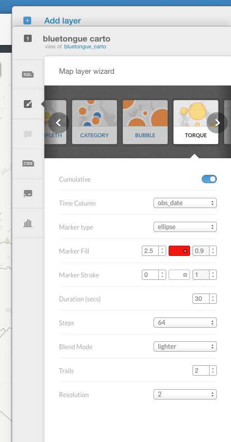
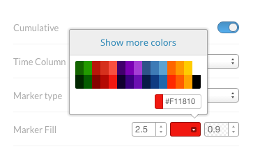
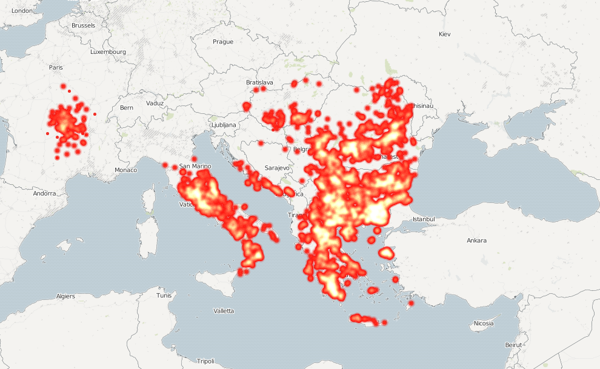

> [GIS fundamentals | Training Course](agenda.md) ▸ **Create & disseminate an animation of disease spread over time**

## Targeted skills
By the end of this module, you will know:
* create an animation of disease cases over time
* disseminate your visualization to the web

## Data

```
the dataset uploaded in previous module
```

## Exercise outline & memos

### 1. Creating an animation of disease cases over time

Our goal here it to create an animation of animal disease cases registered. 

To create a new map:

```
[From Carto Dashboard]
Select "Your maps"

From there simply click on button "NEW MAP" (top-right)

Click on "bluetongue_carto" dataset and click on button "CREATE MAP" (bottom-righ)

Rename your newly create map "bluetongue_disease_spread" by just clicking on
top-left "Untitled Map" and writing the new one

Then on right panel, click the brush icon (tooltip showing "wizard" when hovering on it)

And after having clicled to "Torque" wizard, reproduce settings shown below:
```



To get the proper color for "Marker Fill", click on the "colored box" and enter
the following code: "#F11810"



Once done, you should get the following map:



Obviously, this is a bit disappointing to share a static map considering that we
have just created a compelling time animation of bluetongue spread from Feb. 2014 to Dec. 2015.

To share the animation, there is nothing simpler !

### 2. Disseminating your visualization to the web

To make your visualization accessible by the world:

```
Click on "PUBLISH" link (top-right)

Under "Get the link" section, simply copy (ctrl+c) the url provided 
(in my case: https://franckalbinet.carto.com/viz/d1957f20-8a31-11e6-a66c-0e05a8b3e3d7/public_map)

And share it via email with your colleague or/and open it on a new Browser window.
```

[Click to see my version of the visualization](https://franckalbinet.carto.com/viz/d1957f20-8a31-11e6-a66c-0e05a8b3e3d7/public_map)

To play around and explore the wealth of possible visualizations, go through the full
Carto tutorials: [https://carto.com/docs/tutorials/](https://carto.com/docs/tutorials/)


