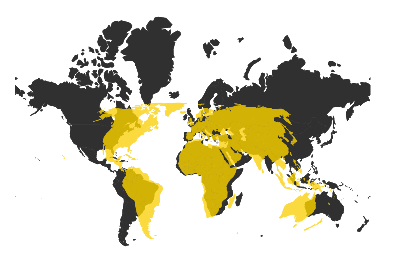

> [GIS fundamentals | Training Course](agenda.md) ▸ **Handling Coordinate Reference Systems (CRS)**

## Targeted skills
By the end of this module, you will know how to:
* change Coordinate Reference System and map projection on the fly
* change & persist CRS and map projection of a shapefile



## Data
Data to be used in this module can be found in the following folders:
```
data/map_projection/
```
## Exercise outline & memos

### 1. Changing CRS on the fly
Open:
```
data/map_projection/world_countries_wgs84.shp
```
and
```
[In QGIS top menu]
Project ▸ Project Properties ▸ CRS (tab) ▸ Check "Enable on the fly CRS transformation"
Select a projection of your choice and click 'Apply' (try Google Mercator and Eckert VI)
```
Tip: Use the 'Filter' input box to filter out the projection list under "Coordinate Reference System" panel.

Notice as well that in the status bar (bottom part of the screen), coordinates are not anymore in lon, lat but in x,y meters.

### 2. Changing and persisting CRS of a layer/shapefile

In the previous case, the CRS associated to the layer/shapefile was not changed but simply update "on the fly" dynamically. If you want to change the CRS for a layer you should do the following:

```
[In QGIS Layers list]
Click right on the layer of interest and select 'Save As'
then you change the CRS via the CRS dropdown and save it (preferably with an explicit name)
```

```
1. Save 'world_countries_wgs84.shp' layer successively using Google Mercator projection and name it 'world_countries_mercator.shp'
2. Save 'world_countries_wgs84.shp' layer successively using Eckert VI projection and name it 'world_countries_eckert_VI.shp'
Open both of them and compare visual aspect
```
Warning: check that the checkbox "Enable on the fly CRS transformation" is unchecked.


