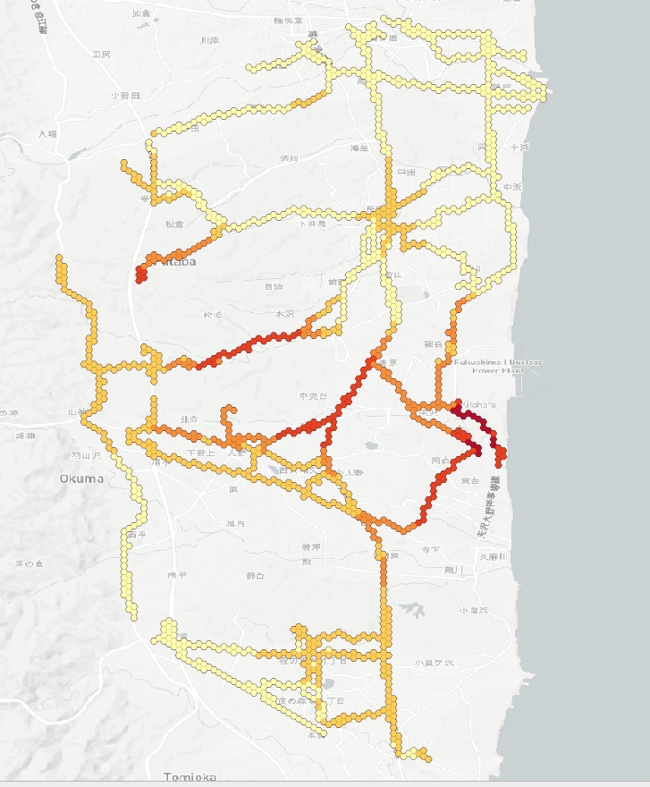
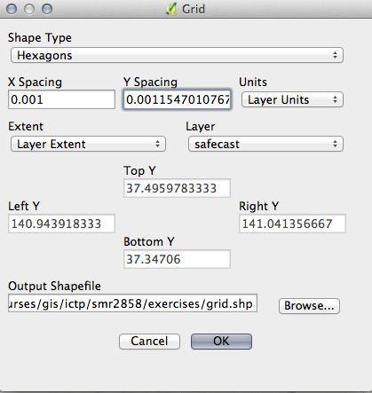

> [GIS fundamentals | Training Course](agenda.md) ▸ **Addressing overplotting with spatial aggregation**

## Targeted skills
By the end of this module, you will know how to:
* create a grid of specified resolution and extent
* perform a spatial query (select grid cells containing measurements only)
* aggregating punctial data into grid cells (max, min, mean, ... value)
* create a choropleth map of aggregated measurement values



## Data
Data to be used in this module can be found in the following folders:
```
data/agg_data
```
## Exercise outline & memos

Our goal in that exercise is to aggregate measurements in a custom grid in order to overcome the issue of overplotting. In our case we will take the maximum value of measurements 'covered' by each specific grid cell.

### 1. Open shapefile & background map
Open:
```
data/agg_data/safecast.shp
```

and add a background map:
```
[In QGIS top menu] 
Web ▸ OpenLayers plugin ▸ OpenStreetMap ▸ OSM Humanitarian Data Model
```

### 2. Create a grid
Creating a grid (rectangle or hexagons) of specified resolution and extent can be done using basic QGIS install but in our case in order to simplify the process we will use MMQGIS plugin.

[Install MMQGIS plugin](gis-setup.md)

```
[In QGIS top menu] 
MMQGIS ▸ Create ▸ Create Grid Layer
```
Fill MMQGIS grid dialog as below:



```
Save create grid as exercises/grid.shp
```

### 2. Spatial query
We will perform a simple spatial query allowing to select grid cells containing measurements only. 
To do so, you will need to install 'Spatial Query' plugin.

[Install Spatial Query plugin](gis-setup.md)

```
[In QGIS top menu] 
Vector ▸ Spatial Query ▸ Spatial Query
```


