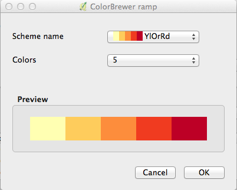

> [GIS fundamentals | Training Course](agenda.md) ▸ **Addressing overplotting with spatial aggregation**

## Targeted skills
By the end of this module, you will know how to:
* create a grid of specified resolution and extent
* perform a spatial query (select grid cells containing measurements only)
* aggregating punctial data into grid cells (max, min, mean, ... value)
* create a choropleth map of aggregated measurement values


## Data
Data to be used in this module can be found in the following folders:
```
data/punctual_data
```
## Exercise outline & memos

### 1. Open shapefile & background map
Open:
```
data/punctual_data/safecast.shp
```

and add a background map:
```
[In QGIS top menu] 
Web ▸ OpenLayers plugin ▸ OpenStreetMap ▸ OSM Humanitarian Data Model
```

### 2. Access thematic mapping settings

To open the dialog including thematic mapping settings:

```
[In QGIS top menu] 
Layer ▸ Properties ...
or
simply click right on 'safecast' layer and choose 'properties' item
or 
even simpler by double clicking on 'safecast' layer
```

### 3. Define thematic mapping settings

To associate values measurements (in our case ionizing radion in counts per minute) with a colours you need to make the following choices:

1. association rule: 'Graduated'
2. column of the attribute table to be looked up: 'value'
3. method to be used: 'Color'
4. color ramp
5. classification method and number of classes


To choose the colour ramp:

```
1. Click 'Color ramp' selector ▸ 'New color ramp'
2. Choose 'ColorBrewer'
3. scheme name 'YlOrRd'
4. number of colors: 5
```


### 5. Fine-tuning
At this stage all ingredients are in place but polishing is still required:

1. tweak symbol size: for instance 1.5
2. make symbol outline (contour) transparent
3. add transparency to the marker fill as well 40-50%

These last steps are justified in order to prevent or at least minimize the issue of [overplotting](https://www.perceptualedge.com/articles/visual_business_intelligence/over-plotting_in_graphs.pdf). 


