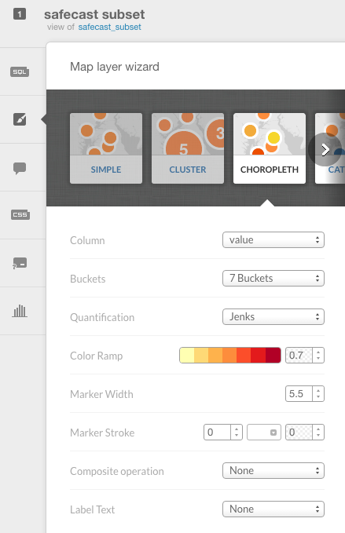

> [GIS fundamentals | Training Course](agenda.md) ▸ **Basic thematic mapping of safecast data**

## Targeted skills
By the end of this module, you will know:
* how to create a simple thematic map of safecast data
* how to use CARTO map layer wizard
* how to disseminate your map online

[Click to visualize CARTO thematic map to be created](https://franckalbinet.carto.com/viz/7cb58b78-ec86-11e6-ba7d-0e3ff518bd15/public_map)


## Data

```
the dataset uploaded in previous module
```

## Exercise outline & memos

### 1. Creating a simple thematic map - choropleth

To create a new map:

```
[From Carto Dashboard]

1. Select "Your maps"

2. From there simply click on button "NEW MAP" (top-right)

3. Click on the safecast dataset loaded in previous exercise and click on button "CREATE MAP" (bottom-right)

4. Rename your newly created map "safecast_choro_point" by just clicking on "Untitled Map" input box (top-left)

5. Then on right panel, click the brush icon (tooltip showing "wizard" when hovering on it)

6. Choose "CHOROPLETH" tab and reproduce settings shown below:
```




To share the animation, there is nothing simpler !

### 2. Disseminating your visualization to the web

To make your visualization accessible by the world:

```
Click on "PUBLISH" link (top-right)

Under "Get the link" section, simply copy (ctrl+c) the url provided 
(in my case: https://franckalbinet.carto.com/viz/d1957f20-8a31-11e6-a66c-0e05a8b3e3d7/public_map)

And share it via email with your colleague or/and open it on a new Browser window.
```

[Click to see my version of the visualization](https://franckalbinet.carto.com/viz/d1957f20-8a31-11e6-a66c-0e05a8b3e3d7/public_map)

To play around and explore the wealth of possible visualizations, go through the full
Carto tutorials: [https://carto.com/docs/tutorials/](https://carto.com/docs/tutorials/)


