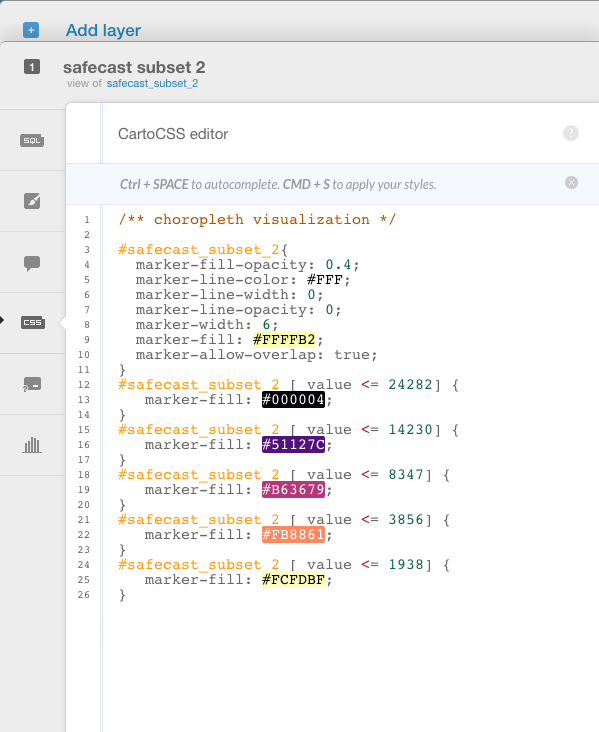
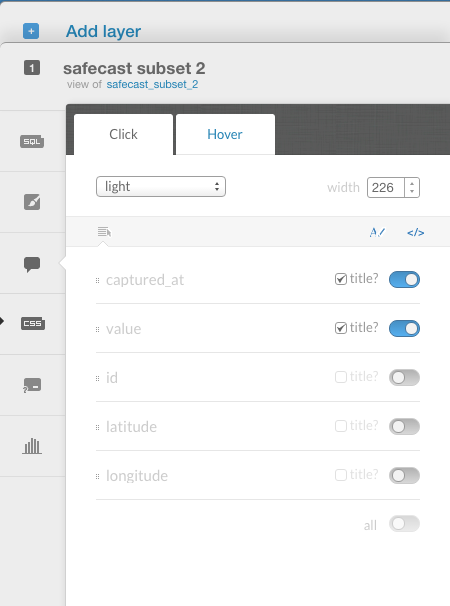

> [GIS fundamentals | Training Course](agenda.md) ▸ **Basic thematic mapping of safecast data**

## Targeted skills
By the end of this module, you will know how to:
* create a simple thematic map of safecast data
* use CARTO map layer wizard
* style your map in an advanced way
* add map interaction
* disseminate your map online

[Click to visualize CARTO thematic map to be created](https://franckalbinet.carto.com/viz/7cb58b78-ec86-11e6-ba7d-0e3ff518bd15/public_map)


## Data

```
the dataset uploaded in previous module
```

## Exercise outline & memos

### 1. Creating a simple thematic map - choropleth

To create a new map:

```
[From Carto Dashboard]

1. Select "Your maps"

2. From there simply click on button "NEW MAP" (top-right)

3. Click on the safecast dataset loaded in previous exercise and click on button "CREATE MAP" (bottom-right)

4. Rename your newly created map "safecast_choro_point" by just clicking on "Untitled Map" input box (top-left)

5. Then on right panel, click the brush icon (tooltip showing "wizard" when hovering on it)

6. Choose "CHOROPLETH" tab and reproduce settings shown below:
```


### 2. Adjust colour palette (advanced styling mode)
One of the strong points of the CARTO application is the ability to use in both basic and advanced mode. The wizard mode will address your most common needs but if you want to have more control over your styling, data, interaction, ... you can do so.

Here we will use our ability to specify in an highly granular way map styles. Here we will use an alternative colour scheme:
[Viridis colour palette](https://cran.r-project.org/web/packages/viridis/vignettes/intro-to-viridis.html)

To customize the colour sheme, activate "CSS" tab in CARTO side toolbar and reproduce code below:



```
  #safecast_subset_2{
    marker-fill-opacity: 0.4;
    marker-line-color: #FFF;
    marker-line-width: 0;
    marker-line-opacity: 0;
    marker-width: 6;
    marker-fill: #FFFFB2;
    marker-allow-overlap: true;
  }
  #safecast_subset_2 [ value <= 24282] {
     marker-fill: #000004;
  }
  #safecast_subset_2 [ value <= 14230] {
     marker-fill: #51127C;
  }
  #safecast_subset_2 [ value <= 8347] {
     marker-fill: #B63679;
  }
  #safecast_subset_2 [ value <= 3856] {
     marker-fill: #FB8861;
  }
  #safecast_subset_2 [ value <= 1938] {
     marker-fill: #FCFDBF;
  }
```

Further resources:
* [Khan Academy video on hexadecimal number system](https://www.youtube.com/watch?v=4EJay-6Bioo)
* [w3schools intro. to hexadecimal colour encoding](https://www.w3schools.com/colors/colors_picker.asp)

### 3. Add interactivity
To add interactivity to your map when clicking or hovering on points of your map, simply
activate "infowindow" tab in CARTO side toolbar and choose the information you would like to see in tooltip when
hovering and clicking.



### 4. Disseminating your visualization to the web

To share your visualization/map, there is nothing simpler:

```
Click on "PUBLISH" link (top-right)

Under "Get the link" section, simply copy (ctrl+c) the url provided 
(in my case: https://franckalbinet.carto.com/viz/7cb58b78-ec86-11e6-ba7d-0e3ff518bd15/public_map)

And share it via email with your colleague or/and open it on a new Browser window.
```

To play around and explore the wealth of possible visualizations, go through the full
Carto tutorials: [https://carto.com/docs/tutorials/](https://carto.com/docs/tutorials/)


