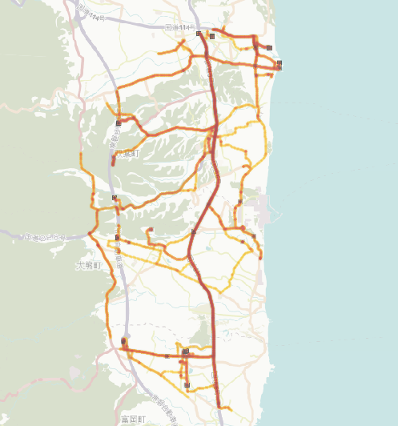
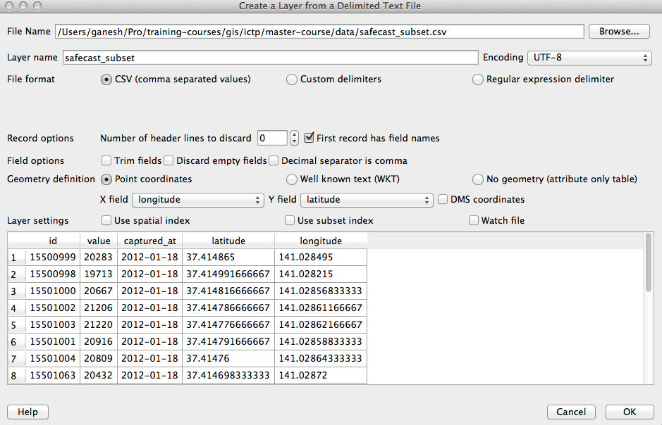

> [GIS fundamentals | Training Course](agenda.md) ▸ **Thematic mapping of punctual data**

## Targeted skills
By the end of this module, you will know how to:
* visualize quantitative data spatial distribution using colour visual encoding
* choose an appropriate color palette/ramp (choropleth map)
* choose a data discretization method (data binning)



## Data
Data to be used in this module can be found in the following folders:
```
data/punctual_data
```
## Exercise outline & memos

### 1. Open shapefile & background map
Open:
```
data/punctual_data/safecast.shp
```

and add a background map:
```
[In QGIS top menu] 
Web ▸ OpenLayers plugin ▸ OpenStreetMap ▸ OSM Humanitarian Data Model
```

### 2. Define thematic mapping method

To open the dialog including thematic mapping settings:

```
[In QGIS top menu] 
Layer ▸ Properties ...

or

simply 'click right on safecast layer' and choose 'properties' item
```


### 1. CSV format
[CSV](https://en.wikipedia.org/wiki/Comma-separated_values) stands for "Comma-separated value" and is a file format allowing to store tabular data in plain text.

For instance, let's consider that we measured ionizing radiation at a particular location and time, we could store the data in a single file with a first row containing the name of the attributes measured separated by commas:

* **id**: unique identifier of the measurement
* **value**: measured value
* **captured_at**: time of measuring
* **latitude & longitude**: georeference
* **unit**: unit of measurement (here in Counts per minute)

and a series of row containing attribute's values for each single measurement separated by commas:
```
id,value,captured_at,latitude,longitude,unit
15500999,20283,2012-01-18,37.414865,141.028495,cpm
15500998,19713,2012-01-18,37.414991666667,141.028215,cpm
15501000,20667,2012-01-18,37.414816666667,141.02856833333,cpm
...
```

### 2. Importing/converting csv file with lat, lon attributes into GIS layer
```
[In QGIS top menu] 
Layer ▸ Add Layer ▸ Add Delimited Text Layer...
```
then reproduce settings shown below (File format, First record as field names, X field, ...:



```
Click "OK"
```

```
Select "WGS84" as CRS then click "Ok"
```

```
Finally, save the layer as shapefile: click right on layer and "Save As"
```

Congrats, you have created your first GIS layer / shapefile from scratch !

### 3. Overlaying layer created over GoogleMap or OpenStreeMap layers

```
Install "OpenLayers Plugin" if not already installed. If/when installed the plugin
needs to be activated (checkbox on).
```

```
[In QGIS top menu] 
Web ▸ OpenLayers plugin ▸ OpenStreetMap ▸ OSM Humanitarian Data Model
```

Warning: Check order of layers in the Layers panel as the point layer might be lower in the stack


