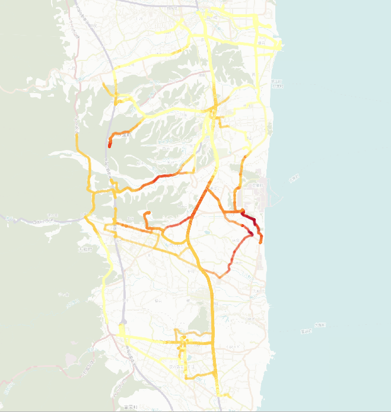

> [GIS fundamentals | Training Course](agenda.md) ▸ **Thematic mapping of punctual data**

## Targeted skills
By the end of this module, you will know how to:
* visualize quantitative data spatial distribution using colour visual encoding
* choose an appropriate color palette/ramp (choropleth map)
* choose a data discretization method (data binning)



## Data
Data to be used in this module can be found in the following folders:
```
data/punctual_data
```
## Exercise outline & memos

### 1. Open shapefile & background map
Open:
```
data/punctual_data/safecast.shp
```

and add a background map:
```
[In QGIS top menu] 
Web ▸ OpenLayers plugin ▸ OpenStreetMap ▸ OSM Humanitarian Data Model
```

### 2. Access thematic mapping settings

To open the dialog including thematic mapping settings:

```
[In QGIS top menu] 
Layer ▸ Properties ...
or
simply click right on 'safecast' layer and choose 'properties' item
or 
even simpler by double clicking on 'safecast' layer
```

### 3. Define thematic mapping settings

To associate values measurements (in our case ionizing radion in counts per minute) with a colours you need to make the following choices:

1. association rule: 'Graduated'
2. column of the attribute table to be looked up: 'value'
3. method to be used: 'Color'
4. color ramp
5. classification method and number of classes


